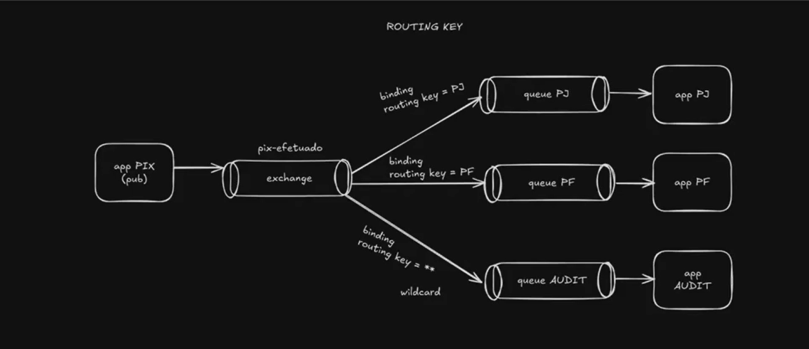

# Projeto PIXMS - Microserviços com Java e RabbitMQ

## Descrição
 Este projeto é uma aplicação desenvolvida em **Java** utilizando o framework **Spring Boot** para implementar uma arquitetura de microserviços integrada com **RabbitMQ**. O projeto tem como objetivo oferecer uma solução escalável e eficiente para comunicação assíncrona entre serviços.

## Modelo de arquitetura do projeto



## Tecnologias Utilizadas
- **Java 21**
- **Spring Boot 3.4.2**
- **Maven** para gerenciamento de dependências
- **Spring Web** para criação de endpoints RESTful
- **Spring Cloud Stream** para construção de microserviços escaláveis e orientados a eventos
- **Spring for RabbitMQ** para integração com o RabbitMQ

## Estrutura do Projeto

```
/src 
 |-- main 
     |-- java 
         |-- tech.buildrun.pixms 
             |-- controller 
             |-- service 
             |-- config 
             |-- model 
 |-- resources 
             |-- application.yml
             
```


## Configuração do RabbitMQ
 No arquivo **docker-compose.yml**, configure os seguintes parâmetros:

```docker
services:
  rabbitmq:
    image: rabbitmq:3.13-management
    ports:
      - 15672:15672
      - 5672:5672
```

## Executando o Projeto

1. Instale o RabbitMQ (ou utilize um contêiner Docker com a imagem oficial rabbitmq:management).
2. Configure o serviço do rabbit em detalhes no arquivo docker-compose.yml.
3. Utilize o comando docker-compose up para subir o container do rabbit e acessar sua interface web:


## Contribuição
- Fork este repositório
- Crie uma branch com sua funcionalidade (`git checkout -b feature/nova-feature`)
- Envie seu código (`git push origin feature/nova-feature`)
- Abra um Pull Request

## Licença
 Este projeto está licenciado sob a [MIT License](LICENSE).
